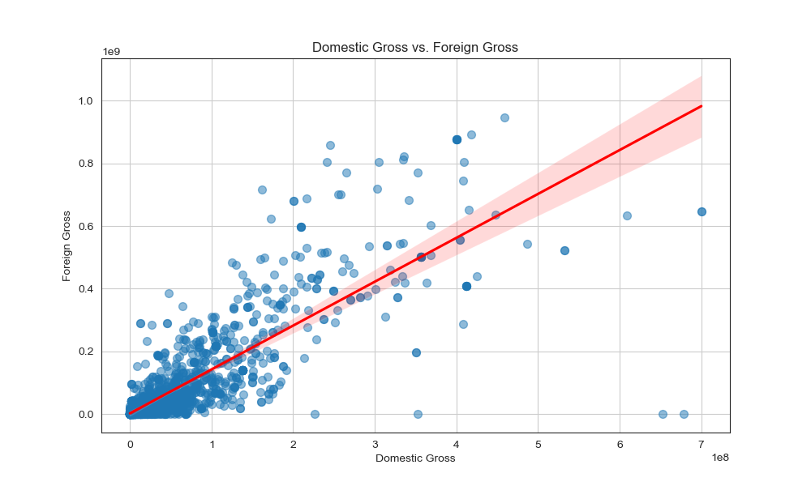
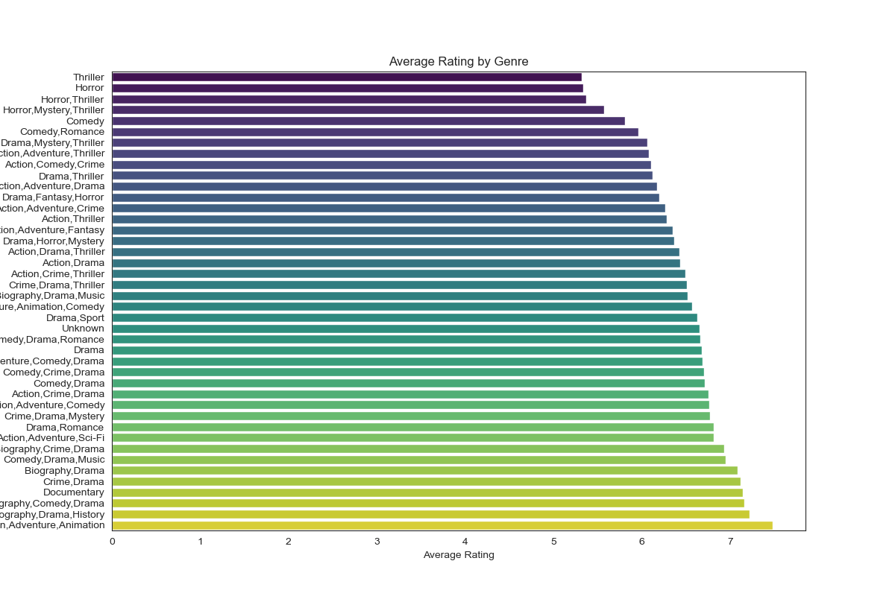

# Movie and Box Office Analysis

**Author**: Noah Meakins

## Overview

This project analyzes various factors that influence the box office success of movies. By examining data on domestic and foreign gross revenues, production budgets, genres, and ratings, the goal is to identify key trends and provide actionable insights for maximizing box office performance. The analysis includes data cleaning, exploratory data analysis (EDA), visualization, and correlation analysis.

## Business Problem

The main business problem is to understand which factors most significantly impact a movie’s box office performance. This knowledge can help movie studios make data-driven decisions on budget allocation, genre selection, and marketing strategies. Movie studios need to maximize box office revenues but often face uncertainty about which factors most contribute to success. Understanding these relationships can inform strategic decisions, leading to more profitable movie productions and effective marketing campaigns.

## Data

The dataset includes information on domestic and foreign gross revenues, production budgets, genres, average ratings, and the number of votes. Data was collected from various sources including IMDb, The Numbers, Box Office Mojo, and The MovieDB. The target variables are domestic gross, foreign gross, and worldwide gross revenues.

## Methods

The process for analyzing the data included data cleaning and merging, exploratory data analysis (EDA), and visualization to understand the distribution and relationships within the data. Data preparation involved cleaning and merging datasets, handling missing values, and filtering relevant data. Analysis included EDA to explore data distribution and relationships. This approach allows for a comprehensive understanding of key factors influencing movie performance, supporting data-driven business decisions.

## Results

Business Recommendations:

1. Invest in High Production Budgets:
   - Given the strong correlation with worldwide gross, investing in higher production budgets could yield better financial returns.
2. Focus on Popular Genres:
   - Biography-Drama-History and Action-Adventure-Animation movies tend to receive higher ratings, indicating a potential area for strategic focus.
3. Target Global Markets:
   - Since domestic and foreign grosses are highly correlated, a strategy that maximizes domestic performance is likely to succeed internationally as well.

### Correlation Heatmap


### Scatter Plot: Domestic Gross vs. Foreign Gross



### Scatter Plot: Production Budget vs. Worldwide Gross


### Scatter Plot: Runtime Minutes vs. Number of Votes


### Bar Plot: Average Rating by Genre



## Conclusions

My findings suggest that investing in higher production budgets and focusing on popular genres can enhance box office performance. Additionally, improving movie ratings through quality production and a balanced runtime, can attract more votes and increase revenues.

1. Investment Strategy: Focus on movies with higher production budgets to maximize revenue potential.

2. Genre Selection: Prioritize genres like Biography-Drama-History and Action-Adventure-Animation movies that tend to receive higher ratings and audience engagement.

3. Global Market Strategy: Develop marketing and distribution strategies that enhance domestic performance, which in turn could boost international revenues when released internationally.

## For More Information

Please review my full analysis in [My Jupyter Notebook](Movie_Box_Office_Analysis.ipynb) or my [Presentation](PDF/Movie_Box_Office_Analysis_Presentation.pdf).

For any additional questions, please contact **Noah Meakins | <unknownerror66@outlook.com>**

## Repository Structure

```
├── __init__.py                          <- .py file that signals to python these folders contain packages
├── README.md                            <- The top-level README for reviewers of this project
├── cleanedData                          <- Folder for any finalized data
│   ├── cleaned_data.csv                 <- final result of cleaned and merged data
├── Movie_Box_Office_Analysis.ipynb      <- Narrative documentation of analysis in Jupyter notebook
├── PDF                                  <- PDF folder for any PDF files used
│   ├── DS_Project_Presentation.pdf      <- PDF version of project presentation
├── code
│   ├── __init__.py                      <- .py file that signals to python these folders contain packages
│   ├── visualizations.py                <- .py script to create finalized versions of visuals for project
│   ├── load_data.py                     <- .py script to load datasets from source files
│   ├── merge_data.py                    <- .py script to merge cleaned datasets
│   ├── data_preparation.py              <- .py script used to pre-process and clean data
│   └── EDA of Provided Movie Data.ipynb <- Notebook containing data exploration
├── data                                 <- Both sourced externally and generated from code
└── images                               <- Both sourced externally and generated from code
```
